<!-- KC//GITHUB v2.0 — Kauã Casella · identidade "Alta Performance" -->

<p align="center">
  
</p>

<h3 align="center">Hello World! Eu sou o Kauã Casella! 👋</h3>

<p align="center">
  
  <a href="https://www.linkedin.com/in/kaua-casella"></a>
  <a href="mailto:kauacasella2018@gmail.com"></a>
  <a href="https://portfolio-kaua-xi.vercel.app"></a>
</p>

---

<table>
<tr>
<td width="55%" valign="top">

```python
class KauaCasella:

    # ── Stack ──────────────────────────
    languages  = ["Python", "JavaScript",
                  "C#"]
    web        = ["HTML5", "CSS3"]
    databases  = ["MySQL"]
    tools      = ["Figma", "Unity"]

    # ── Sobre mim ──────────────────────
    graduacao  = "🎓 Ciência da Computação — FECAP"
    interesse  = "💻 Estágio em TI"
    aprendendo = ("📚 MySQL, back-end, HTML,"
                  " CSS e JavaScript")
    objetivo   = ("🚀 Atuar na área de Dados:"
                  " análise, organização e"
                  " tratamento de informações")
    fora_do_pc = ("🏋️ academia · 🤾 handebol"
                  " · 🎯 FPS tático")

    def __str__(self) -> str:
        return (
            f"{self.interesse}\n"
            f"{self.objetivo}\n"
            f"> Código é treino."
        )

print(KauaCasella())
```

</td>
<td width="45%" valign="top" align="center">


</td>
</tr>
</table>

---

<h3 align="center">🚀 Skills</h3>

<p align="center">
  
</p>

<div align="center">

<table>
  <tr>
    <td align="center" width="25%"><code>// WEB</code></td>
    <td align="center" width="25%"><code>// LINGUAGENS</code></td>
    <td align="center" width="25%"><code>// DADOS</code></td>
    <td align="center" width="25%"><code>// FERRAMENTAS</code></td>
  </tr>
  <tr>
    <td align="center" valign="top">
      <br/>
      <br/>
      
    </td>
    <td align="center" valign="top">
      <br/>
      
    </td>
    <td align="center" valign="top">
      
    </td>
    <td align="center" valign="top">
      <br/>
      
    </td>
  </tr>
</table>

</div>

<p align="center"><code>◎ QUEST PRINCIPAL</code></p>

<p align="center">
  
  &nbsp;→&nbsp;
  
  &nbsp;→&nbsp;
  
  &nbsp;→&nbsp;
  
</p>

---

<p align="center"><sub><b><i>GG. Código é treino.</i></b></sub></p>
